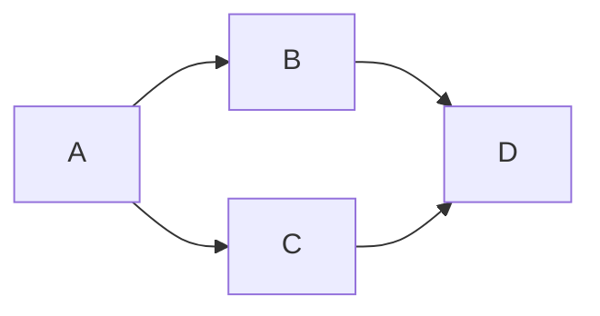
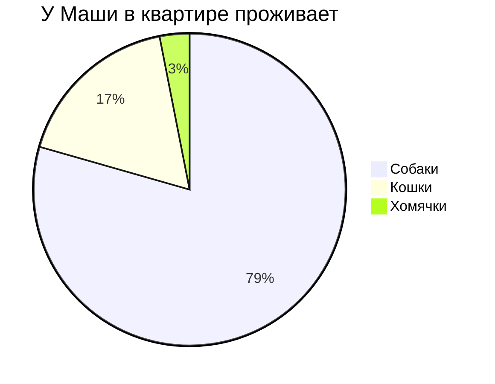

# Test-Diplom-Work

```mermaid
graph LR;
    A-->B;
    A-->C;
    B-->D;
    C-->D;
```

```mermaid
pie title У Маши в квартире проживает
    "Собаки" : 386
    "Кошки" : 85
    "Хомячки" : 15
```
